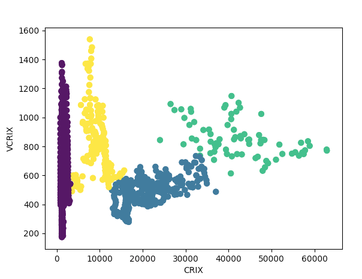

[](http://quantlet.de/)

## [](http://quantlet.de/) **GMMcluster** [](http://quantlet.de/)

```yaml

Name of Quantlet: GMMcluster

Published in: 'Metis Variational Bayes'

Description: 'Clustering CRIX Currency Index and its volatility VCRIX with Gaussian Mixture Model (GMM)'

Keywords: 'Clustering, Gaussian Mixture Model, Currency Index, CRIX, VCRIX'

Author: Rui Ren

Submitted: 'Wed, Jan 9 2019 by Rui Ren'

```



### PYTHON Code
```python

import matplotlib.pyplot as plt
import seaborn as sns; sns.set()
import numpy as np
from sklearn.mixture import GaussianMixture
import pandas as pd


data=pd.read_csv('cvc.csv')
vol=data['VCRIX'] #volatility of CRIX
cp=data['CRIX']
X=pd.concat([vol, cp], axis=1)

from sklearn.datasets.samples_generator import make_blobs
#X, y_true = make_blobs(n_samples=400, centers=4, cluster_std=0.60, random_state=0)
#X = X[:, ::-1] # flip axes for better plotting

gmm =GaussianMixture(n_components=4).fit(X)
labels = gmm.predict(X)
#plt.scatter(X[:, 0], X[:, 1], c=labels, s=40, cmap='viridis')
plt.scatter(cp, vol, c=labels, s=40, cmap='viridis')
plt.xlabel('CRIX')
plt.ylabel('VCRIX')
plt.show()
```

automatically created on 2019-01-09